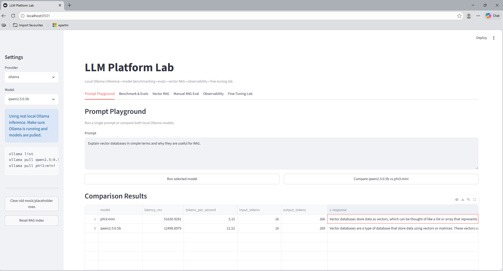
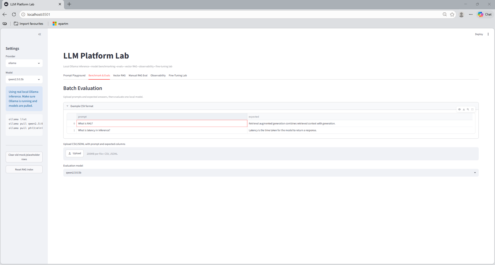
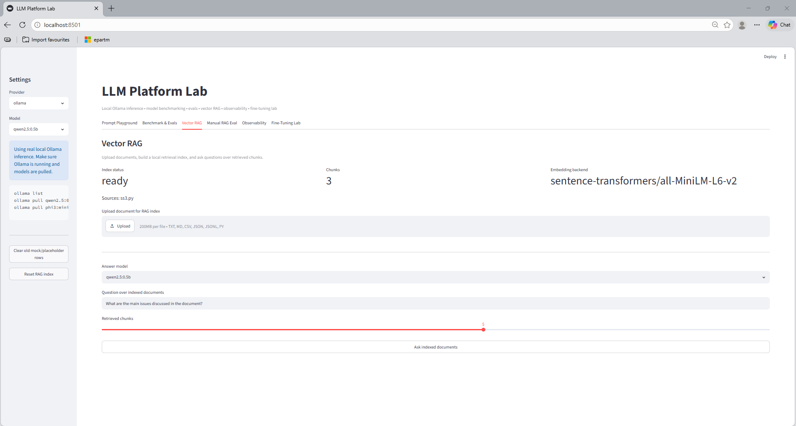
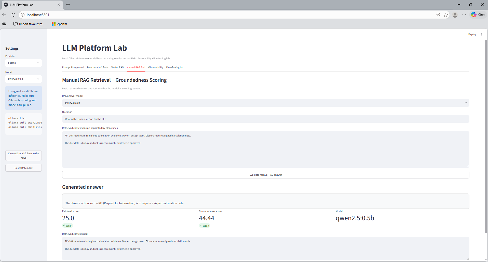
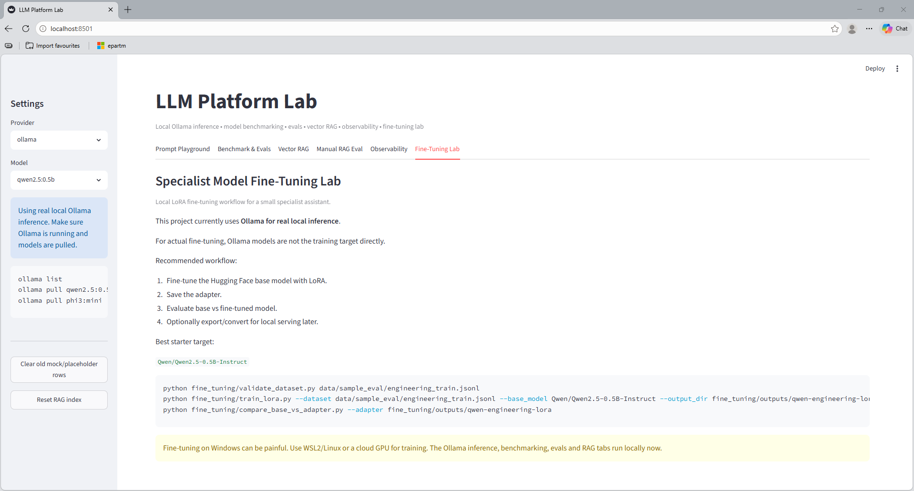
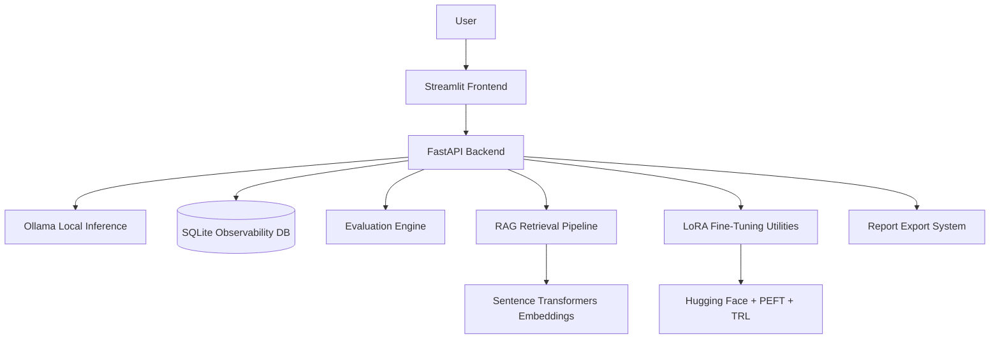

# LLM Platform Lab

A portfolio-grade AI infrastructure platform for inference benchmarking, LLM evaluation, RAG evaluation, observability, and local LoRA fine-tuning workflows.

The platform combines:
- local LLM inference
- evaluation pipelines
- RAG experimentation
- observability tooling
- provider benchmarking
- lightweight model adaptation

Built using:
- FastAPI
- Streamlit
- Ollama
- Hugging Face
- PEFT
- TRL
- SQLite
- Sentence Transformers

---

# Features

- Prompt playground for local LLM testing
- Multi-model comparison benchmarking
- Latency and token tracking
- Batch evaluation datasets
- Vector-style RAG retrieval workflows
- Retrieval and groundedness scoring
- SQLite observability + run history
- Fine-tuning workflow lab using LoRA adapters
- Report export utilities
- Local-first AI experimentation environment

---

# Demo


Full video:

[demo.mp4](assets/demo/demo.mp4)

---

# Screenshots

## Playground + Model Comparison



---

## Benchmark & Evaluations



---

## Vector RAG



---

## Manual RAG Evaluation



---

## Fine-Tuning Lab



---

# What it demonstrates

This project demonstrates practical AI engineering concepts including:

- inference benchmarking
- evaluation pipelines
- RAG experimentation
- observability systems
- local inference tooling
- provider comparison
- groundedness scoring
- lightweight fine-tuning
- AI infrastructure design

---

# Architecture



---

# Quick Start

## 1. Create virtual environment

```bash
python -m venv .venv
```

Activate environment:

### Linux / macOS

```bash
source .venv/bin/activate
```

### Windows PowerShell

```powershell
.\.venv\Scripts\Activate.ps1
```

---

## 2. Install dependencies

```bash
pip install -r requirements.txt
```

---

## 3. Configure environment variables

Create `.env`:

```env
OLLAMA_BASE_URL=http://localhost:11434
```

---

## 4. Install Ollama

Install Ollama locally and pull models:

```bash
ollama pull qwen2.5:0.5b
ollama pull phi3:mini
```

---

## 5. Start backend

```bash
python -m uvicorn backend.main:app --reload --host 127.0.0.1 --port 8000
```

---

## 6. Start frontend

In another terminal:

```bash
python -m streamlit run frontend/app.py
```

Open the Streamlit URL shown in the terminal.

---

# Offline / Local Mode

The platform is designed primarily for local inference using Ollama.

No paid APIs are required.

This allows:
- fully local experimentation
- offline benchmarking
- lightweight AI infrastructure prototyping
- privacy-friendly testing workflows

---

# Prompt Playground

The playground supports:
- single-model testing
- multi-model comparison
- latency measurement
- token throughput tracking
- response comparison

Example prompt:

```text
Explain why vector databases are useful for RAG systems.
```

---

# Benchmark & Evaluation

Upload CSV or JSONL evaluation datasets to benchmark local models.

Example dataset:

```text
data/sample_eval/eval_prompts.csv
```

The platform records:
- latency
- token usage
- model responses
- comparison metrics

---

# Vector RAG

The RAG module supports:
- local document indexing
- embedding generation
- retrieval workflows
- chunk-based document search
- local vector-style retrieval experiments

Embedding backend:

```text
sentence-transformers/all-MiniLM-L6-v2
```

---

# Manual RAG Evaluation

The manual RAG evaluator provides:
- retrieval scoring
- groundedness scoring
- retrieved-context inspection
- hallucination analysis workflows

Paste retrieved chunks and evaluate whether the generated answer is properly grounded in context.

---

# Fine-Tuning Lab

The fine-tuning lab demonstrates:
- LoRA adapter workflows
- PEFT pipelines
- lightweight model specialization
- engineering-domain adaptation

Validate dataset:

```bash
python fine_tuning/validate_dataset.py data/sample_eval/engineering_train.jsonl
```

Run LoRA training:

```bash
python fine_tuning/train_lora.py \
  --dataset data/sample_eval/engineering_train.jsonl \
  --base_model Qwen/Qwen2.5-0.5B-Instruct \
  --output_dir fine_tuning/outputs/qwen-engineering-lora
```

Compare base model vs adapter:

```bash
python fine_tuning/compare_base_vs_adapter.py \
  --adapter fine_tuning/outputs/qwen-engineering-lora
```

GPU recommended for actual training workloads.

---

# Suggested CV Line

Built an AI infrastructure platform for benchmarking, evaluating and observing LLM applications, including provider comparison, vector-style RAG evaluation, groundedness scoring, latency/token tracking, SQLite observability workflows, and local LoRA fine-tuning of specialist models.

---

# Project Structure

```text
backend/            FastAPI backend API
frontend/           Streamlit dashboard UI
core/               providers, scoring, observability utilities
evals/              evaluation tooling
rag/                retrieval pipeline utilities
fine_tuning/        LoRA training + comparison scripts
reports/            report export utilities
data/               sample eval + RAG datasets
scripts/            helper launch scripts
assets/
  demo/             demo GIF/video
  screenshots/      README screenshots
```

---

# Tech Stack

- Python
- FastAPI
- Streamlit
- Ollama
- Hugging Face Transformers
- PEFT
- TRL
- Sentence Transformers
- SQLite
- Pandas
- Scikit-learn

---

# Current Status

Implemented:
- local inference workflows
- benchmarking dashboards
- evaluation tooling
- observability tracking
- RAG experimentation
- retrieval scoring
- groundedness analysis
- LoRA fine-tuning workflows
- report export systems

Planned future improvements:
- advanced vector DB integration
- distributed evaluation runners
- async job orchestration
- LangSmith/OpenTelemetry-style tracing
- multi-agent evaluation pipelines
- cloud deployment support

---

# License

MIT